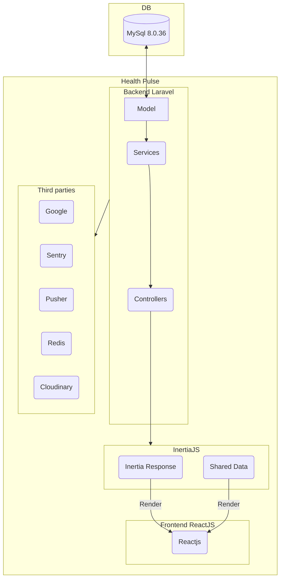

# Health Pulse
A project that aims to help simplify healthcare provider's workload and provide a reliable platform for those who need medical attention.
  

## Architecture Diagram

  

## Requirements for this project:

  

- Node.js version 18.18.0 or higher is required.

- PHP 8.1 is required

- MySQL 8.0.36 is required

- InertiaJS 1.0.0 required

- Chakra UI 2.8.2 is required

- ReactJS 18.2.0 is required

  

## To run this project locally:

  

- Run composer install to install all dependencies.

- Run npm install to install all dependencies.

- Create a database in mysql.

- Run `php artisan migrate --seed` to run the migration files and seed the database.

- Run `npm run dev`.

- Run `php artisan serve` to start the php web server.
  

## Directory Structure
### The root directory
    .
    ├── app						# Contains the core code of the application.
    ├── bootstrap               # Contains the `app.php` file which bootstraps the framework, also houses a `cache` directory.
    ├── config   				# Contains all of the application's configuration files.
    ├── database  				# Directory contains your database migrations, model factories, and seeds.
    ├── public					# Directory contains the `index.php` file, which is the entry point for all requests entering the application and configures autoloading.
    ├──	resources				# Contains the views as well as the raw, un-compiled assets such as CSS or JavaScript.
    ├──	routes					# Contains all of the route definitions for your application.
    ├──	storage					# Contains logs, file based sessions, file caches, and other files generated by the framework.
    ├── test					# Contains the automated tests.
    ├── vendor					# Directory contains the Composer dependencies.
    └── README.md
   
   ### The App Directory
    app
    ├── Broadcasting			# Contains all of the broadcast channel classes.
    ├── Console 				# Contains all of the custom Artisan commands.
    ├── Events 					# Directory houses event classes.
    ├── Exceptions            	# Directory contains all of the custom exceptions.
    ├──	Http                    # Contains controllers, middleware, and form requests.
    ├──	Jobs					# Contains queueable jobs.
    ├──	Mail                    # Contains all of the classes that represent emails sent by the application.
    ├── Models					# Contains all Eloquent model classes.
    ├── Notifications          	# Contains all of the "transactional" notifications that are sent by the application.
    └── Providers               # Contains all of the service providers for the application.